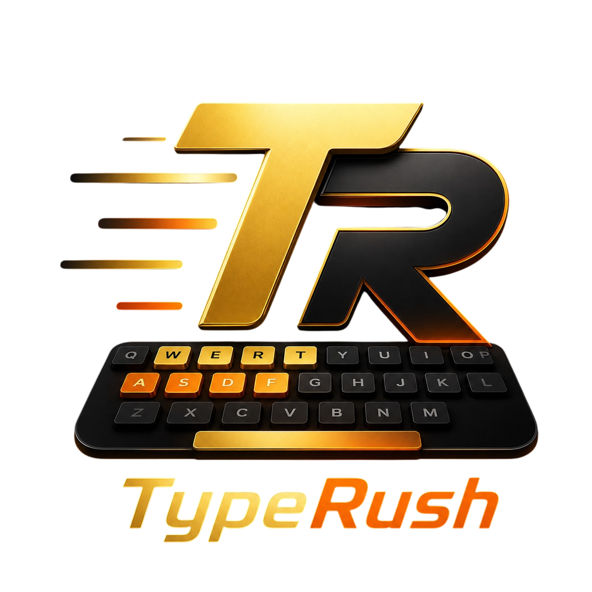
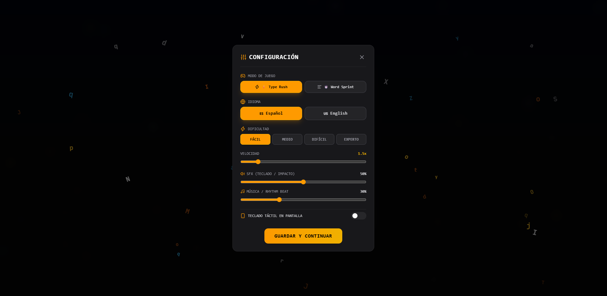
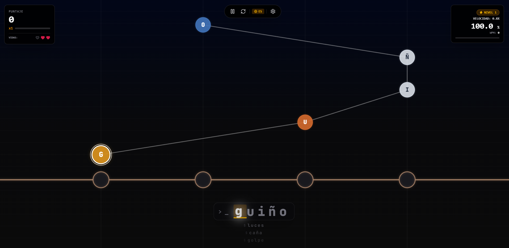
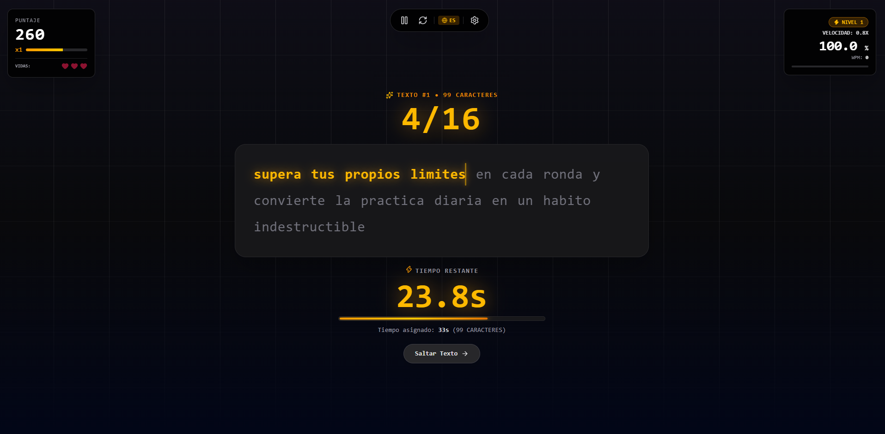

  

  # ⚡ TypeRush

  **Plataforma de Mecanografía Multimodo, Progresión Dinámica de Nivel y Experiencia Rítmica**

  
  
  
  
  

---

## 🌟 Descripción General

**TypeRush** es una aplicación web moderna diseñada para transformar la práctica del tipeo en una experiencia inmersiva, competitiva y altamente dinámica. Combinando conceptos rítmicos estilo arcade con pruebas de texto contrarreloj, TypeRush ofrece una interfaz neón retro-futurista enriquecida con animaciones GSAP y soporte multilingüe integral.

---

## 🎮 Modos de Juego

### ⚡ 1. Type Rush (Carriles Rítmicos)
Modalidad de velocidad donde palabras y letras se desplazan dinámicamente a través de carriles visuales estilo Guitar Hero. El jugador debe tipear las teclas precisas antes de que atraviesen la línea de impacto.

### ⏱️ 2. Word Sprint (Párrafos Contrarreloj)
Prueba de tipeo basada en párrafos y mini-textos adaptativos. El juego otorga un límite de tiempo calculado con precisión en función de la cantidad total de caracteres del texto, desafiando la precisión y agilidad del usuario.

---

## 🔥 Características Destacadas

- 📈 **Progresión Dinámica de Nivel (Dificultad Adaptativa)**: El juego inicia en Nivel 1 (*Fácil*) y evalúa el rendimiento en tiempo real, aumentando de nivel automáticamente (hasta *Experto*), incrementando la velocidad de caída y desplegando vocabulario con palabras de mayor longitud y complejidad.
- 🌐 **Internacionalización Global (i18n)**: Cambio fluido entre **Español** e **Inglés** en tiempo real. Aplica dinámicamente a menús, modales, alertas, botones, teclados y diccionarios de palabras/textos.
- 🎬 **Animaciones e Impacto GSAP**: Entradas elásticas, rebotes de modal, sacudidas de alerta por fallos, banners emergentes de *Subida de Nivel* y contadores animados de puntuación final.
- 📱 **Diseño Híbrido Escritorio & Móvil**: Teclado táctil virtual responsivo en pantalla con soporte háptico para teléfonos y tablets, junto a detección nativa de teclado físico para computadoras.
- 📊 **Métricas de Rendimiento en Tiempo Real**: Cálculo instantáneo de **WPM** (Palabras por minuto), **Precisión %**, racha de **Combo Máximo** y desglose de juicios de tipeo (*Perfecto, Genial, Bueno, Fallo*).

---

## 📸 Capturas de Pantalla

<table width="100%">
  <tr>
    <td width="50%" align="center">
      
       
      <b>Menú Principal & Selección de Modo</b>
    </td>
    <td width="50%" align="center">
      
       
      <b>Modo Type Rush (Carriles de Letras)</b>
    </td>
  </tr>
  <tr>
    <td width="50%" align="center">
      
       
      <b>Modo Word Sprint (Texto Contrarreloj)</b>
    </td>
    <td width="50%" align="center">
      
       
      <b>Configuración & Opciones Multilingüe</b>
    </td>
  </tr>
</table>

---

  Desarrollado con pasión para llevar la agilidad de tipeo al siguiente nivel ⚡

